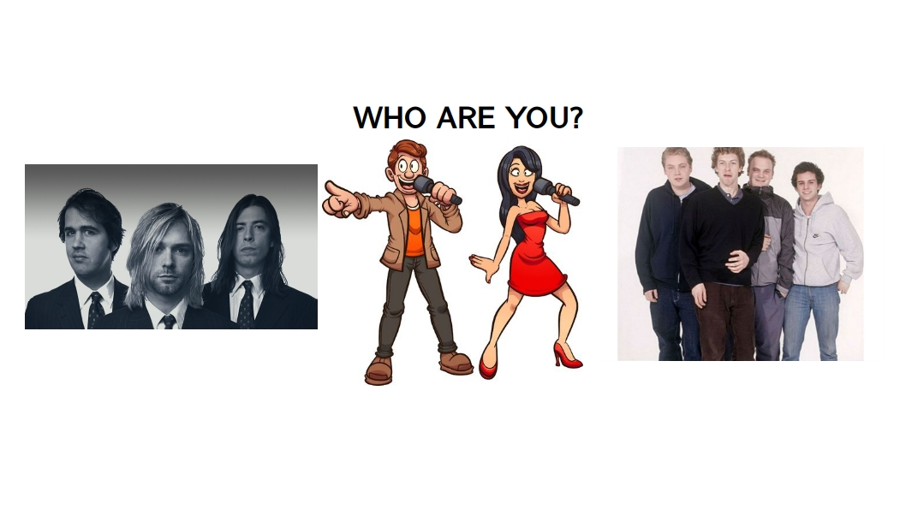

# Lyrics_Compare_NLP

### Write your own lyrics and a Naive Bayes machine learning algorithm will tell you whether your style of texting is more Nirvana like or Coldplay like.

* The file `execute.py` is the executable. In order to deploy it, write `python execute.py` into the command line. Opitionally you can type in other artitsts with `python execute.py -a1 <ARTIST_1> -a2 <ARTIST_2> -n <Number>`. This, however, takes a couple of minutes, because the lyrics of <ARTIST_1> and <ARTIST_2> need to be downloaded from from the *lyricsgenius* library. The parameter <number> is the number of songs for each artist to consider for the Naive Bayes algorithm.
* The command `python execute.py --help` gives you a more general explanation of the optional parameters

* The file `functions.py` contains all the functions for scraping and downloading the lyrics from the *lyricsgenius* library for a given artist
  
* `model.py`contains the machine learning modeling and NLP part

